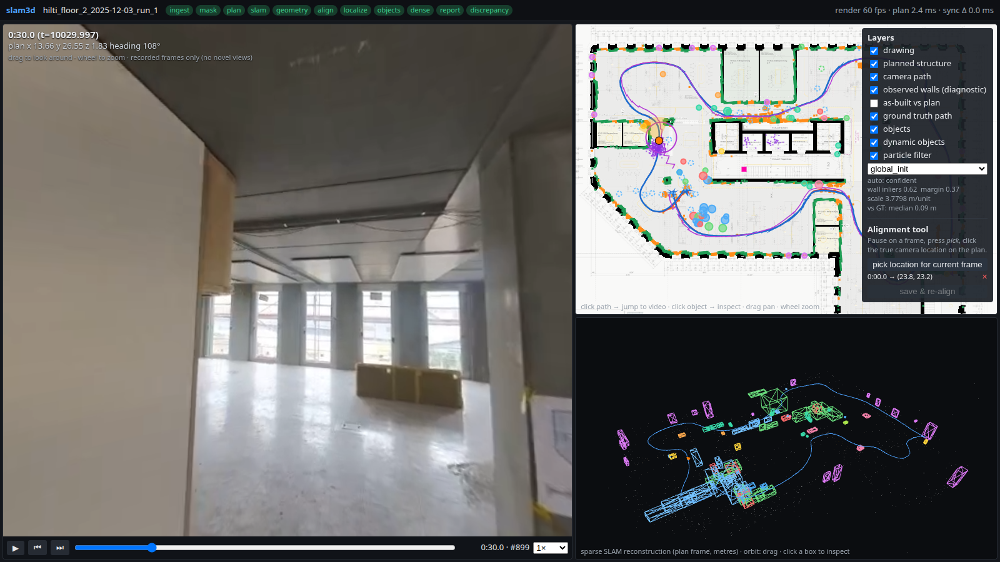
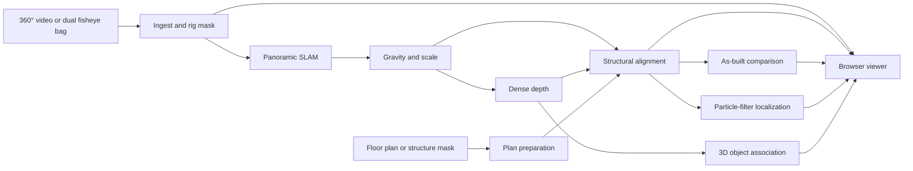
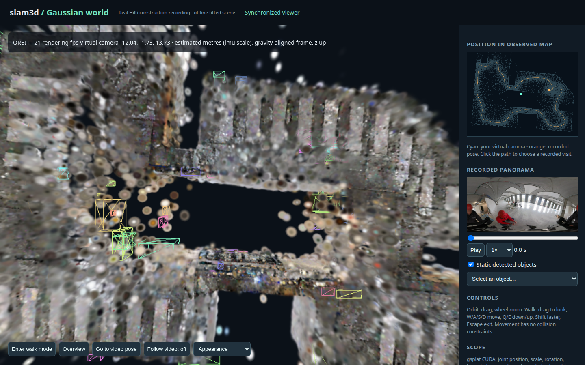

# slam3d

[](https://github.com/Javgilavi/slam3d/actions/workflows/tests.yml)

**Turn a recorded 360° construction walkthrough into an explorable map.** `slam3d` is an offline pipeline for panoramic visual SLAM, dense geometry, floor-plan registration, object mapping, and plan-based localization. A local browser viewer keeps the recording, floor plan, and 3D map in sync.



*Viewer capture from the [Hilti–Trimble–Oxford 2026 dataset](https://huggingface.co/datasets/Hilti-Research/hilti-trimble-slam-challenge-2026). Dataset-derived imagery is CC BY-NC-SA 3.0; see [data and image credits](#data-and-image-credits).*

## At a glance

| Input | Processing | Output |
|---|---|---|
| Stitched equirectangular MP4 or calibrated Hilti dual-fisheye ROS bag; floor-plan mask, drawing, PDF, or DXF | Panorama ingest → stella_vslam → gravity and scale → PanoVGGT depth → structural alignment → objects and localization | Timestamped trajectories, point clouds, depth maps, plan overlays, object tracks, reports, and a synchronized browser viewer |

The core pipeline is **offline** and stage based. Completed stages resume when their configuration is unchanged. The optional Gaussian world viewer renders a fitted appearance scene from an already processed run; it is a research baseline with visible blur and floaters in unseen views.

### What is implemented

- **360° mapping:** calibrated dual-fisheye stitching or direct equirectangular video input, monocular panoramic SLAM with loop closure, gravity alignment, and scale estimation.
- **Plan registration:** structural bird's-eye registration, confidence checks, manually seeded correspondences, local drift refinement, and visibility-aware as-built comparison.
- **Scene understanding:** panoramic depth on keyframes, open-vocabulary YOLOE detections lifted into 3D, static and dynamic object association.
- **Localization and review:** causal particle-filter replay, synchronized video/plan/3D browser viewer, object inspector, and alignment tool.
- **Experimental appearance:** CPU Gaussian fitting and a CUDA-trained scene workflow with a browser `/world` viewer.

## Quick start

### Requirements

Linux, Python 3.12 via [`uv`](https://docs.astral.sh/uv/), Docker, `ffmpeg`, and an NVIDIA GPU with at least 8 GB VRAM for the full dense pipeline. The bootstrap downloads model weights, a visual vocabulary, and browser assets; allow substantial disk space. The pinned Python environment is in [`requirements.lock.txt`](requirements.lock.txt), and upstream versions are recorded in [`third_party/VERSIONS.json`](third_party/VERSIONS.json).

```bash
git clone https://github.com/Javgilavi/slam3d.git
cd slam3d
scripts/bootstrap.sh
source .venv/bin/activate
slam3d doctor
```

To download the public Hilti sample during setup, run `scripts/bootstrap.sh --sample`. The sample is several gigabytes and is licensed separately from this code.

### Process a sample run

```bash
slam3d download-sample --sequence floor_2_2025-12-03_run_1
slam3d run configs/hilti_floor2_1203.yaml
slam3d viewer outputs/hilti_floor_2_2025-12-03_run_1
# Open http://127.0.0.1:8765/
```

The development configuration uses the sample floor plan and reference files downloaded by `download-sample`. To reproduce all reported runs, also download `floor_2_2025-10-28_run_2` and `floor_1_2025-05-05_run_1`, then run the matching files in [`configs/`](configs). A run writes its artifacts under `outputs/<run_name>/`.

### Process your own walkthrough

1. Export a horizon-levelled, stitched **2:1 equirectangular MP4**. Supply a synchronized IMU CSV if available.
2. Prepare a structure mask PNG with walls/columns in black and determine its metres-per-pixel scale. A drawing, PDF, or DXF can be ingested, but review the generated mask before relying on automatic alignment.
3. Copy [`configs/template_equirect_video.yaml`](configs/template_equirect_video.yaml) and set `run_name`, `input.video`, `floorplan.path`, `floorplan.src_res_m_per_px`, and `geometry.camera_height_m`.
4. Run `slam3d run configs/my_site.yaml`, then `slam3d viewer outputs/my_site_walkthrough`.

If alignment is flagged as weak, use the viewer's alignment tool to place a few distinctive frame-to-plan correspondences and rerun the alignment stage. For stage control, `slam3d run CONFIG --stages align,localize --force` recomputes selected stages.

## Pipeline



The implementation lives in [`src/slam3d/`](src/slam3d), the stella driver in [`cpp/stella_driver/`](cpp/stella_driver), the container definition in [`docker/stella/`](docker/stella), and the browser UI in [`viewer/static/`](viewer/static). Coordinate frames, units, and timestamps are defined in [`docs/COORDINATES.md`](docs/COORDINATES.md).

### Main run artifacts

| Path inside `outputs/<run_name>/` | Contents |
|---|---|
| `ingest/`, `slam/` | Stitched frames, timestamps, online/final poses, keyframes, map |
| `geometry/`, `dense/` | Gravity-aligned trajectory and cloud, keyframe depth, dense cloud |
| `floorplan/`, `align/` | Prepared plan, registration report, plan-frame trajectories and overlays |
| `discrepancy/`, `localize/`, `objects/` | As-built candidates, particle-filter replay, object observations |
| `status.json`, `report.json`, `REPORT.md` | Stage state, timing, memory use, and quality summaries |

Raw data, weights, generated runs, and local environments are intentionally ignored by Git. A fresh clone obtains them through the setup and sample download commands.

## Measured results

On the public Hilti–Trimble–Oxford 2026 dataset, using an RTX 5070 Laptop GPU with 8 GB VRAM and 31 GB RAM:

| Sequence | Role | SLAM tracked | Plan-frame 2D median error | Known-start localization median error |
|---|---|---:|---:|---:|
| Floor 2, 2025-12-03 run 1 | Development | 96% | 0.09 m | 0.48 m |
| Floor 2, 2025-10-28 run 2 | Held out | 68% | 0.20 m | 0.23 m |
| Floor 1, 2025-05-05 run 1 | Held out | 100% | 0.43 m | 0.69 m |

These figures are from the recorded evaluation runs, not a promise for other buildings. Plan alignment was flagged as weak on the early-construction sequence; localization and as-built reporting depend on usable structural evidence. Ground truth was used for evaluation, apart from the explicitly labelled known-start localization tests. See [`docs/RESULTS.md`](docs/RESULTS.md) for per-stage runtime, metrics, conditions, and failure cases.

## Experimental Gaussian world



*The scene is fitted from the same public Hilti recording. This overview illustrates the browser viewer; its novel-view quality is limited.*

The selected offline CUDA scene contains 366,398 Gaussians. On identical held-out **appearance views**, PSNR improved from 14.50 to 17.53 dB and SSIM from 0.467 to 0.520 compared with the earlier CPU scene. Geometry and initial point colours used the full recording, so these numbers do **not** measure independent reconstruction. Novel camera positions still show severe blur, floaters, and occlusion errors.

To try the simpler CPU baseline after a dense sample run:

```bash
slam3d gaussians outputs/hilti_floor_2_2025-12-03_run_1 \
  --max-points 45000 --views 12 --steps 120 --size 96
python scripts/export_gaussian_demo.py outputs/hilti_floor_2_2025-12-03_run_1
slam3d viewer outputs/hilti_floor_2_2025-12-03_run_1
# Open http://127.0.0.1:8765/world
```

The screenshot and quoted CUDA result require the separate training procedure in [`docs/GAUSSIAN_HANDOFF.md`](docs/GAUSSIAN_HANDOFF.md); the CPU command above does not reproduce them.

## Validation and known limits

```bash
python -m pytest -q tests
python scripts/validate_viewer.py outputs/hilti_floor_2_2025-12-03_run_1
python scripts/summarize_results.py
```

The viewer validation requires a processed sample run and Playwright Chromium. The geometry and Gaussian unit tests run locally; GPU and end-to-end checks require the downloaded assets and hardware above.

- Monocular SLAM can lose tracking in low light or aggressive motion. One held-out run lost a 28-second segment; interpolated poses are flagged.
- Floor-plan registration and global localization can fail where visible walls provide too little evidence. As-built claims are suppressed when alignment is not confident.
- Automatic wall extraction from a colour-hatched drawing failed on the sample. Use an inspected structure mask.
- Object extents are observed-point spreads, and object accuracy has no ground-truth evaluation here.
- The standard viewer displays recorded panoramas and geometry. The Gaussian world supports free camera motion but does not provide reliable photorealistic unseen views or live camera localization.

## Documentation

- [`docs/RESULTS.md`](docs/RESULTS.md): full benchmark conditions and measured outcomes.
- [`docs/DECISIONS.md`](docs/DECISIONS.md): design choices and research sources.
- [`docs/COORDINATES.md`](docs/COORDINATES.md): coordinate systems, scale, and timestamps.
- [`docs/GAUSSIAN_HANDOFF.md`](docs/GAUSSIAN_HANDOFF.md): Gaussian experiments and exact CUDA recipe.
- [`docs/PROGRESS.md`](docs/PROGRESS.md): development history.

## Data and image credits

The screenshots in [`docs/assets/`](docs/assets) are derived from the **Hilti–Trimble–Oxford 2026** construction dataset by Samuele Centanni, Yuhao Zhang, Yifu Tao, Julien Kindle, Frank Neuhaus, Tilman Koß, Aryaman Patel, Michael Helmberger, Emilia Szymańska, Torben Gräber, and Maurice Fallon. The [dataset](https://huggingface.co/datasets/Hilti-Research/hilti-trimble-slam-challenge-2026) is licensed [CC BY-NC-SA 3.0](https://creativecommons.org/licenses/by-nc-sa/3.0/); the screenshots are transformed visualizations and retain that noncommercial share-alike restriction. See the [dataset paper](https://arxiv.org/abs/2607.06464) and [challenge repository](https://github.com/Hilti-Research/hilti-trimble-slam-challenge-2026) for the source and citation.

The original slam3d code is [MIT licensed](LICENSE). That license does not replace the dataset image license above. Third-party software and weights have their own terms. The core pipeline uses stella_vslam (BSD-2-Clause), PanoVGGT code (MIT), YOLOE/Ultralytics (AGPL-3.0), and three.js (MIT). Their pinned sources and versions are listed in [`third_party/VERSIONS.json`](third_party/VERSIONS.json). Downloaded source trees and weights are not committed here.
